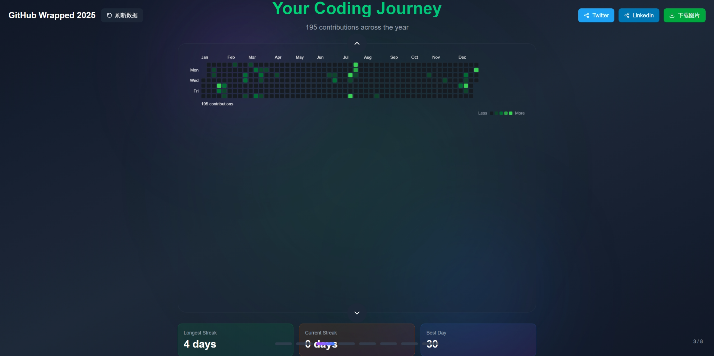

<div align="center">

  <!-- Title & Logo -->
  <h1 align="center">
    
    <br>
    GitHub Wrapped
  </h1>

  <!-- Badges -->
  <p align="center">
    <a href="https://github.com/Freakz3z/GitHub-Wrapped/stargazers">
      
    </a>
    <a href="https://github.com/Freakz3z/GitHub-Wrapped/network/members">
      
    </a>
    <a href="https://github.com/Freakz3z/GitHub-Wrapped/issues">
      
    </a>
    <a href="./LICENSE">
      
    </a>
    <a href="https://githubwrapped-roan.vercel.app">
      
    </a>
  </p>

  <!-- Subtitle -->
  <p align="center">
    <strong>你的年度代码之旅，可视化呈现。</strong>
  </p>

  <!-- Description -->
  <p align="center">
    GitHub Wrapped 是一个为开发者打造的年度回顾工具，通过精美的幻灯片展示你的 GitHub 活动数据。
    <br>
    分析你过去一年的代码贡献，生成可分享的精美总结。
  </p>

  <!-- Links -->
  <p align="center">
    <a href="README_en.md">English</a> •
    <a href="https://githubwrapped-roan.vercel.app">🚀 在线体验</a> •
    <a href="#-技术栈">技术栈</a> •
    <a href="#-本地开发">本地开发</a>
  </p>

</div>

---

## 基础设施合作伙伴

<div align="center">

  <!-- ESA Badge -->
  <a href="https://www.aliyun.com/product/esa">
    
  </a>

  <p>
    <strong>本项目由阿里云 ESA 提供加速、计算和保护</strong>
    <br>
    <em>Powered by <a href="https://www.aliyun.com/product/esa">Aliyun Edge Secure Acceleration (ESA)</a></em>
  </p>

</div>

---

## 目录

- [功能特性](#-功能特性)
- [幻灯片概览](#-幻灯片概览)
- [技术栈](#-技术栈)
- [快速开始](#-快速开始)
- [环境变量](#-环境变量)
- [本地开发](#-本地开发)
- [贡献指南](#-贡献指南)
- [开源协议](#-开源协议)

---

## ✨ 功能特性

### 🎨 沉浸式体验
- **交互式幻灯片**：通过流畅的动画和过渡效果浏览你的年度数据
- **键盘支持**：使用左右箭头键在幻灯片之间导航
- **进度指示器**：跟踪你在幻灯片中的进度
- **响应式设计**：完美适配桌面、平板和移动设备
- **现代 UI**：玻璃拟态设计风格，渐变背景与自定义滚动条

### 📊 全面统计分析
- **总贡献数**：提交代码、拉取请求、问题提交和代码审查的综合统计
- **获得的 Star 数**：所有仓库获得的 Star 总数
- **Pull Requests**：追踪你的 PR 贡献
- **创建的 Issue**：通过问题报告看到你的影响力
- **代码审查**：你审查的 PR 数量
- **最长连续贡献**：你最长连续贡献的天数
- **当前连续贡献**：你当前的连续贡献天数
- **最佳贡献日**：你贡献次数最多的一天

### 🗓️ 贡献热力图
- 通过精美的热力图可视化你每日的代码活跃度
- 查看贡献历史中的连续记录和模式
- 带有贡献级别的交互式日历视图

### 🏆 成就徽章
- **贡献徽章**：根据总贡献数解锁徽章（100、500、1K、2.5K）
- **连续贡献徽章**：通过保持连续贡献获得徽章（7、30、100 天）
- **Star 徽章**：为获得的 Star 收集徽章（10、50、100、500）
- **PR 徽章**：对拉取请求的认可（10、50、100）
- **特殊徽章**：多语言专家（5+ 种语言）、代码审查员（100+ 次审查）
- **进度追踪**：查看你接近锁定徽章的进度

### 🌍 常用编程语言
- 编程语言的可视化分布
- 按语言百分比细分
- 带有颜色指示的语言标记
- 追踪你的语言多样性

### 📦 热门仓库
- 你最受欢迎的仓库
- 仓库描述信息
- 每个仓库的主要语言
- Star 数量和分支信息
- 开放的问题追踪

### 🔒 隐私优先
- **只读访问**：仅请求读取公开数据的权限
- **无数据存储**：你的数据永远不会存储在我们的服务器上
- **安全认证**：使用 NextAuth 进行 GitHub OAuth 认证

---

## 🎯 幻灯片概览

| 幻灯片 | 描述 |
|-------|-------------|
| **1. 介绍页** | 带有用户个人资料和简介的个性化欢迎 |
| **2. 统计页** | 6 个动画卡片显示关键指标 |
| **3. 热力图页** | 月度活动卡片，详细统计和连续贡献信息 |
| **4. 语言页** | 交互式语言分布，进度条和图表 |
| **5. 仓库页** | 热门仓库的响应式网格布局 |
| **6. 徽章页** | 成就徽章（已解锁和锁定） |
| **7. 里程碑页** | 关键成就与图标和描述 |
| **8. 总结页** | 感谢信息和总结统计 |

---

## 🛠️ 技术栈

### 前端

- **框架** - [Next.js 16](https://nextjs.org/) (App Router + Turbopack)
- **UI 库** - [React 19](https://react.dev/)
- **样式** - [Tailwind CSS 4](https://tailwindcss.com/)
- **动画** - [Framer Motion](https://www.framer.com/motion/)
- **图标** - [Lucide React](https://lucide.dev/)

### 后端与认证

- **认证** - [NextAuth.js](https://next-auth.js.org/) (GitHub OAuth)
- **API** - [GitHub GraphQL API](https://docs.github.com/en/graphql)

### 数据可视化

- **图表** - [Recharts](https://recharts.org/)
- **日历** - [react-activity-calendar](https://github.com/gr2m/react-activity-calendar)

### 开发工具

- **语言** - [TypeScript](https://www.typescriptlang.org/)
- **包管理器** - npm / pnpm
- **部署** - [Vercel](https://vercel.com/)

---

## 🚀 快速开始

### 一键部署

[](https://vercel.com/new/clone?repository-url=https%3A%2F%2Fgithub.com%2FFreakz3z%2FGitHub-Wrapped)

### 前置要求

- 安装 Node.js 18+
- GitHub 账号
- GitHub OAuth App

---

## ⚙️ 环境变量

创建 `.env.local` 文件并配置以下环境变量：

```env
# GitHub OAuth App 凭证
# 获取方式：https://github.com/settings/developers
GITHUB_ID=your_github_client_id
GITHUB_SECRET=your_github_client_secret

# NextAuth 配置
# 生成方式：openssl rand -base64 32
NEXTAUTH_SECRET=your_random_secret_string

# 应用 URL
NEXTAUTH_URL=http://localhost:3000
```

### GitHub OAuth App 设置

1. 访问 [GitHub Developer Settings](https://github.com/settings/developers)
2. 点击 "New OAuth App"
3. 填写以下信息：
   - **Application name**: GitHub Wrapped
   - **Homepage URL**: `http://localhost:3000` (开发环境) 或你的域名 (生产环境)
   - **Authorization callback URL**: `http://localhost:3000/api/auth/callback/github`
4. 获取 `Client ID` 并生成 `Client Secret`

---

## 💻 本地开发

### 安装

```bash
# 克隆仓库
git clone https://github.com/Freakz3z/GitHub-Wrapped.git
cd GitHub-Wrapped

# 安装依赖
npm install
```

### 运行开发服务器

```bash
npm run dev
```

在浏览器中打开 [http://localhost:3000](http://localhost:3000)

### 构建生产版本

```bash
npm run build
npm start
```

### 代码检查

```bash
npm run lint
```

---

## 🤝 贡献指南

我们欢迎所有形式的贡献！

### 如何贡献

1. Fork 本仓库
2. 创建特性分支 (`git checkout -b feature/AmazingFeature`)
3. 提交更改 (`git commit -m 'Add some AmazingFeature'`)
4. 推送到分支 (`git push origin feature/AmazingFeature`)
5. 开启 Pull Request

### 贡献方向

- [ ] 新增徽章类型和成就
- [ ] 创建新的幻灯片模板
- [ ] 改进 UI/UX 动画和过渡效果
- [ ] 添加更多社交分享平台
- [ ] 实现图片下载功能
- [ ] 添加更多语言支持
- [ ] 优化数据可视化
- [ ] 提升性能和加载速度
- [ ] 改进移动端响应式设计

---

## 📄 开源协议

本项目采用 [Apache License 2.0](LICENSE) 开源协议。

```
Copyright 2024 GitHub Wrapped Contributors

Licensed under the Apache License, Version 2.0 (the "License");
you may not use this file except in compliance with the License.
You may obtain a copy of the License at

    http://www.apache.org/licenses/LICENSE-2.0

Unless required by applicable law or agreed to in writing, software
distributed under the License is distributed on an "AS IS" BASIS,
WITHOUT WARRANTIES OR CONDITIONS OF ANY KIND, either express or implied.
See the License for the specific language governing permissions and
limitations under the License.
```

---

<div align="center">

  Made with ❤️ by the developer community

  <!-- Share Badge -->
  [](https://twitter.com/intent/tweet?text=Check%20out%20my%20GitHub%20Wrapped%20%F0%9F%8E%81&url=https%3A%2F%2Fgithub.com%2FFreakz3z%2FGitHub-Wrapped&hashtags=GitHubWrapped)

  <!-- Star History -->
  [](https://star-history.com/#Freakz3z/GitHub-Wrapped&Date)

</div>
